# AvanaHR — ERD & Skema Database (Wave 1 MVP)

**Engine:** MySQL 8 (InnoDB, utf8mb4). **Konvensi:** PK `id` BIGINT UNSIGNED AUTO_INCREMENT · semua tabel bisnis punya `tenant_id` BIGINT (FK → tenants, indexed) · timestamps · master data `deleted_at` (soft delete) · uang `BIGINT` (Rupiah penuh) · koordinat `DECIMAL(10,7)` · waktu `TIMESTAMP` UTC · tanggal periode `DATE`.

**ATURAN INDEXING GLOBAL (wajib):**
1. Setiap FK di-index (Laravel `foreignId()->constrained()` sudah otomatis).
2. Kolom pertama hampir semua composite index = `tenant_id` — karena setiap query ter-scope tenant.
3. Kolom yang dipakai filter list (status, tanggal, tipe) → composite index bersama `tenant_id`.
4. Kolom unik bisnis → unique composite dengan `tenant_id` (unik per tenant, bukan global).
5. Jangan index kolom kardinalitas sangat rendah sendirian (boolean) — gabungkan dalam composite.
6. Tabel volume tinggi (attendance_events, audit_logs, payslip_lines) wajib punya covering index untuk query utamanya; pertimbangkan partisi by bulan bila > 10 juta baris.

---

## 1. Diagram Relasi Inti (Mermaid)

```mermaid
erDiagram
  tenants ||--o{ users : has
  tenants ||--o{ employees : has
  tenants ||--o{ branches : has
  tenants ||--o{ org_units : has
  org_units ||--o{ org_units : parent
  org_units ||--o{ positions : has
  positions ||--o{ employees : holds
  branches ||--o{ employee_branch_assignments : has
  employees ||--o{ employee_branch_assignments : assigned
  employees ||--|| users : login
  employees ||--o{ employee_contracts : has
  employees ||--o{ employee_movements : has
  employees ||--o{ employee_basic_salaries : has
  employees ||--o{ employee_schedules : has
  shifts ||--o{ employee_schedules : uses
  employees ||--o{ attendance_events : logs
  employees ||--o{ attendance_summaries : daily
  employees ||--o{ leave_requests : submits
  leave_types ||--o{ leave_requests : of
  leave_types ||--o{ leave_balances : of
  employees ||--o{ leave_balances : owns
  employees ||--o{ overtime_requests : submits
  employees ||--o{ attendance_corrections : submits
  payroll_groups ||--o{ payroll_group_components : has
  salary_components ||--o{ payroll_group_components : in
  salary_components ||--o{ component_value_mappings : mapped
  component_formulas ||--o{ formula_items : has
  salary_components }o--|| component_formulas : uses
  payroll_groups ||--o{ payroll_runs : runs
  payroll_runs ||--o{ payroll_run_employees : includes
  payroll_run_employees ||--o{ payslip_lines : details
  employees ||--o{ payroll_run_employees : paid
  employees ||--o{ employee_component_overrides : overrides
  employees ||--o{ payroll_adjustments : corrected
  approvals ||--o{ approval_actions : steps
  approval_flows ||--o{ approval_steps : defines
```



> Render ERD lengkap per domain saat implementasi; diagram di atas peta relasi utama.

---

## 2. Platform & Fondasi

### tenants
| Kolom | Tipe | Ket |
| --- | --- | --- |
| id | BIGINT PK | |
| name, slug | VARCHAR | slug UNIQUE |
| plan_id | FK → plans | |
| employee_id_prefix | VARCHAR(10) | |
| is_active | BOOLEAN | |
| settings | JSON | override tenant_settings ringkas |
**Index:** UNIQUE(slug), INDEX(plan_id).

### plans / plan_features
`plans`: code UNIQUE (essential/professional/enterprise360), name. `plan_features`: plan_id, feature_code VARCHAR — UNIQUE(plan_id, feature_code).

### users
| Kolom | Tipe |
| --- | --- |
| tenant_id | FK nullable (null = super admin) |
| employee_id | FK nullable → employees |
| name, email, password | |
| mfa_secret | VARCHAR nullable, encrypted |
| is_active | BOOLEAN |
| last_login_at | TIMESTAMP |
**Index:** UNIQUE(tenant_id, email), INDEX(tenant_id, is_active), UNIQUE(employee_id).
Spatie tables (`roles`, `permissions`, `model_has_roles`, …) pakai team feature = `tenant_id` sebagai team key.

### approval_flows / approval_steps / approvals / approval_actions
```
approval_flows : tenant_id, approvable_type VARCHAR, name, is_active
  UNIQUE(tenant_id, approvable_type, name); INDEX(tenant_id, approvable_type, is_active)
approval_steps : flow_id FK, seq TINYINT, approver_type ENUM(direct_manager,user,role,position),
                 approver_id BIGINT nullable, min_amount BIGINT nullable, sla_hours SMALLINT nullable
  UNIQUE(flow_id, seq)
approvals      : tenant_id, approvable_type, approvable_id, flow_id, current_step TINYINT,
                 status ENUM(pending,approved,rejected,cancelled), requested_by FK users
  INDEX(tenant_id, status), INDEX(approvable_type, approvable_id), INDEX(tenant_id, requested_by)
approval_actions: approval_id FK, step_seq, approver_user_id FK, delegated_from_user_id FK nullable,
                 status ENUM(pending,approved,rejected), note TEXT, acted_at TIMESTAMP nullable
  INDEX(approval_id, step_seq), INDEX(approver_user_id, status)   -- inbox "pending approval saya"
approval_delegations: tenant_id, from_user_id, to_user_id, start_date, end_date, is_active
  INDEX(tenant_id, from_user_id, is_active)
```

### audit_logs (volume tinggi)
```
tenant_id, user_id FK nullable, auditable_type, auditable_id, event VARCHAR(30),
old_values JSON, new_values JSON, ip_address VARCHAR(45), user_agent VARCHAR, created_at
INDEX(tenant_id, auditable_type, auditable_id), INDEX(tenant_id, user_id, created_at),
INDEX(tenant_id, created_at)  -- pertimbangkan partisi bulanan
```

### tenant_settings
`tenant_id, key VARCHAR, value JSON` — UNIQUE(tenant_id, key).

### Master referensi platform (tanpa tenant_id, effective-dated)
```
tax_ptkp_rates : ptkp_status ENUM(TK0..K3), year SMALLINT, annual_amount BIGINT — UNIQUE(ptkp_status, year)
tax_ter_rates  : category ENUM(A,B,C), income_from BIGINT, income_to BIGINT, rate DECIMAL(5,2), year
                 INDEX(category, year, income_from)
bpjs_rates     : type ENUM(kesehatan,jht,jp,jkk,jkm), employee_pct DECIMAL(5,2), employer_pct DECIMAL(5,2),
                 salary_cap BIGINT nullable, effective_date DATE — INDEX(type, effective_date)
regional_minimum_wages : province_code, city_code nullable, amount BIGINT, effective_year — INDEX(province_code, effective_year)
holidays       : tenant_id nullable (null = nasional), date DATE, name — INDEX(tenant_id, date)
```

---

## 3. Organisasi & Karyawan

### org_units
`tenant_id, parent_id FK self nullable, name, type ENUM(company,division,department,unit), cost_center VARCHAR nullable, effective_date DATE, deleted_at`
**Index:** INDEX(tenant_id, parent_id), INDEX(tenant_id, type).

### positions
`tenant_id, org_unit_id FK, name, grade_id FK nullable, reports_to_position_id FK self nullable, deleted_at`
**Index:** INDEX(tenant_id, org_unit_id), INDEX(reports_to_position_id).

### grades
`tenant_id, code, name, salary_min BIGINT, salary_max BIGINT, deleted_at` — UNIQUE(tenant_id, code). (Band SUSU BR-13.)

### branches
`tenant_id, code, name, address TEXT, latitude DECIMAL(10,7), longitude DECIMAL(10,7), geofence_radius_m SMALLINT DEFAULT 100, timezone VARCHAR DEFAULT 'Asia/Jakarta', cost_center, deleted_at`
**Index:** UNIQUE(tenant_id, code).

### employees
```
tenant_id, employee_code VARCHAR, full_name, nik_ktp VARCHAR(16) encrypted, npwp encrypted nullable,
email, phone, birth_date, gender, marital_status, ptkp_status ENUM(TK0..K3),
position_id FK, grade_id FK, org_unit_id FK (denormalized untuk filter cepat),
employment_status ENUM(pkwt,pkwtt,magang,kemitraan), join_date DATE, status ENUM(active,inactive),
inactive_date DATE nullable, direct_manager_employee_id FK self nullable,
bank_name, bank_account encrypted, bank_account_name,
payroll_group_id FK, bpjs_kes_no nullable, bpjs_tk_no nullable,
face_embedding VARBINARY(1024) nullable encrypted, face_enrolled_at nullable,
photo_path nullable, deleted_at
```
**Index:** UNIQUE(tenant_id, employee_code), UNIQUE(tenant_id, nik_ktp_hash)*, INDEX(tenant_id, status), INDEX(tenant_id, org_unit_id, status), INDEX(tenant_id, position_id), INDEX(tenant_id, payroll_group_id, status), INDEX(direct_manager_employee_id).
*Kolom encrypted tidak bisa di-unique langsung → tambah kolom `nik_ktp_hash` = SHA-256, unique per tenant. Pola sama untuk npwp & bank_account bila perlu pencarian.

### employee_branch_assignments
`tenant_id, employee_id FK, branch_id FK, is_primary BOOLEAN, effective_date` — UNIQUE(employee_id, branch_id), INDEX(tenant_id, branch_id).

### employee_contracts
`tenant_id, employee_id FK, contract_no, type ENUM, start_date, end_date nullable, file_path, status ENUM(active,expired,terminated)`
**Index:** INDEX(tenant_id, end_date, status)  ← query "kontrak akan berakhir".

### employee_movements
`tenant_id, employee_id FK, type ENUM(mutation,promotion,demotion), from_position_id, to_position_id, from_org_unit_id, to_org_unit_id, from_grade_id, to_grade_id, from_branch_id, to_branch_id, from_salary_snapshot BIGINT, to_salary BIGINT nullable, effective_date DATE, status ENUM(pending,approved,rejected,applied), note`
**Index:** INDEX(tenant_id, employee_id, effective_date), INDEX(tenant_id, status, effective_date) ← scheduler apply.

### employee_terminations
`tenant_id, employee_id FK UNIQUE, type ENUM(resign,phk,pensiun,meninggal), effective_date, reason, clearance_completed_at nullable, status`

### employee_change_requests (maker-checker)
`tenant_id, employee_id FK, requested_by FK users, changes JSON (old/new), status ENUM(pending,approved,rejected), applied_at`
**Index:** INDEX(tenant_id, status).

### custom_field_definitions / custom_field_values
`definitions`: tenant_id, entity VARCHAR('employee'), label, key, field_type ENUM(text,number,date,select), options JSON, is_required, sort_order — UNIQUE(tenant_id, entity, key).
`values`: definition_id FK, entity_id BIGINT, value TEXT — UNIQUE(definition_id, entity_id).

---

## 4. Shift, Kehadiran, Cuti, Lembur

### shifts
`tenant_id, name, start_time TIME, end_time TIME, is_overnight BOOLEAN, late_tolerance_min SMALLINT, break_minutes SMALLINT, deleted_at` — INDEX(tenant_id).

### shift_patterns / shift_pattern_items
`patterns`: tenant_id, name, cycle_days TINYINT. `items`: pattern_id, day_seq TINYINT, shift_id FK nullable (null = off) — UNIQUE(pattern_id, day_seq).

### employee_schedules (volume: karyawan × hari)
`tenant_id, employee_id FK, date DATE, shift_id FK nullable, is_day_off BOOLEAN, source ENUM(generated,manual)`
**Index:** UNIQUE(employee_id, date), INDEX(tenant_id, date) ← rekap harian per tenant.

### attendance_events (volume tertinggi — append only)
```
tenant_id, employee_id FK, event_uuid CHAR(36), type ENUM(in,out),
occurred_at TIMESTAMP (server), device_captured_at TIMESTAMP,
latitude, longitude, branch_id FK nullable (branch tervalidasi),
channel ENUM(mobile_face,web,kiosk,import),
similarity_score DECIMAL(5,4) nullable, liveness_passed BOOLEAN nullable,
is_outside_geofence BOOLEAN, is_suspicious BOOLEAN, device_id VARCHAR nullable
```
**Index:** UNIQUE(event_uuid) ← idempotency; INDEX(tenant_id, employee_id, occurred_at); INDEX(tenant_id, occurred_at); INDEX(tenant_id, is_suspicious, occurred_at). Partisi bulanan bila besar.

### attendance_summaries (1 baris per karyawan per tanggal)
```
tenant_id, employee_id FK, date DATE, schedule_shift_id FK nullable,
clock_in TIMESTAMP nullable, clock_out nullable,
status ENUM(present,late,early_leave,absent,leave,holiday,day_off,duty,wfh),
late_minutes SMALLINT, work_minutes SMALLINT, overtime_minutes SMALLINT,
is_locked BOOLEAN DEFAULT false, locked_at nullable
```
**Index:** UNIQUE(employee_id, date), INDEX(tenant_id, date, status), INDEX(tenant_id, date, is_locked) ← prasyarat payroll.

### attendance_corrections
`tenant_id, employee_id FK, date DATE, field ENUM(clock_in,clock_out,status), old_value, proposed_value, reason TEXT, attachment_path, status ENUM(pending,approved,rejected), applied_at`
**Index:** INDEX(tenant_id, status), INDEX(employee_id, date).

### leave_types
`tenant_id, name, code, annual_quota TINYINT, deduct_balance BOOLEAN, allow_carry_over BOOLEAN, carry_over_max TINYINT, carry_over_expiry_month TINYINT, requires_attachment BOOLEAN, min_notice_days TINYINT, deleted_at` — UNIQUE(tenant_id, code).

### leave_balances
`tenant_id, employee_id FK, leave_type_id FK, year SMALLINT, entitled DECIMAL(5,1), used, pending, carried_over, expired`
**Index:** UNIQUE(employee_id, leave_type_id, year), INDEX(tenant_id, year).

### leave_requests
`tenant_id, employee_id FK, leave_type_id FK, start_date, end_date, total_days DECIMAL(4,1), reason, attachment_path nullable, status ENUM(pending,approved,rejected,cancelled)`
**Index:** INDEX(tenant_id, status), INDEX(employee_id, start_date, end_date) ← cek overlap & kalender, INDEX(tenant_id, start_date).

### overtime_requests
`tenant_id, employee_id FK, date DATE, planned_start TIME, planned_end TIME, actual_minutes SMALLINT nullable, reason, status ENUM(pending,approved,rejected,actualized)`
**Index:** INDEX(tenant_id, status), UNIQUE(employee_id, date, planned_start), INDEX(tenant_id, date, status) ← tarikan payroll.

---

## 5. Payroll (arsitektur 4 lapis BPR — detail semantik di PRD Payroll)

### component_formulas / formula_items
```
component_formulas: tenant_id, name, description, contract_display ENUM(process,setting), is_active, deleted_at
formula_items: formula_id FK, seq TINYINT, source_type ENUM(earning,deduction,umr,constant),
               source_component_id FK nullable, multiplier DECIMAL(10,4), add_operand BIGINT DEFAULT 0,
               prorate BOOLEAN — UNIQUE(formula_id, seq)
```

### working_day_rules
`tenant_id, name, method ENUM(fixed,calendar,workdays), divisor_days TINYINT nullable, deleted_at`

### salary_components
```
tenant_id, code, name, type ENUM(earning,deduction), effective_date DATE, sort_order SMALLINT,
is_taxable BOOLEAN, process_type ENUM(regular,irregular), frequency ENUM(monthly,weekly,biweekly),
show_on_payslip BOOLEAN, show_on_contract BOOLEAN, pay_after_inactive BOOLEAN,
calc_basis ENUM(formula,table,fixed), formula_id FK nullable, fixed_amount BIGINT nullable,
min_amount BIGINT nullable, max_amount BIGINT nullable,
prorate_enabled BOOLEAN, overtime_related BOOLEAN, bpjs_basis BOOLEAN, is_active, deleted_at
```
**Index:** UNIQUE(tenant_id, code), INDEX(tenant_id, type, is_active).

### payroll_groups / payroll_group_components
```
payroll_groups: tenant_id, code, name, frequency ENUM, period_start_day TINYINT, cutoff_day TINYINT,
  working_day_rule_id FK, attendance_source ENUM(current,previous), overtime_source ENUM(current,previous),
  prorate_method ENUM(calendar,workdays), is_active, deleted_at — UNIQUE(tenant_id, code)
payroll_group_components: payroll_group_id FK, salary_component_id FK, is_prorated BOOLEAN,
  is_overtime_base BOOLEAN — UNIQUE(payroll_group_id, salary_component_id)
```

### component_value_mappings
`tenant_id, salary_component_id FK, employment_status nullable, position_id FK nullable, grade_id FK nullable, branch_id FK nullable, value BIGINT, priority SMALLINT, effective_date DATE`
**Index:** INDEX(tenant_id, salary_component_id, effective_date), INDEX(grade_id), INDEX(position_id).

### employee_component_overrides
`tenant_id, employee_id FK, salary_component_id FK, value BIGINT, sk_no nullable, attachment_path nullable, effective_date, is_active, status ENUM(pending,approved,rejected)`
**Index:** UNIQUE(employee_id, salary_component_id, effective_date), INDEX(tenant_id, status).

### employee_basic_salaries (append-only)
`tenant_id, employee_id FK, effective_date DATE, sk_no, is_umr BOOLEAN, amount BIGINT, note, attachment_path`
**Index:** INDEX(employee_id, effective_date DESC) ← ambil gaji berlaku per tanggal.

### payroll_runs
```
tenant_id, payroll_group_id FK, frequency ENUM, run_type ENUM(regular,thr,bonus,final_settlement),
period_start DATE, period_end DATE, cutoff_date DATE, payment_date DATE,
status ENUM(draft,calculated,pending_approval,approved,locked,paid,cancelled),
calculated_at, calculated_by FK users, approved_at, approved_by FK users,
locked_at, locked_by, notes
```
**Index:** INDEX(tenant_id, status), INDEX(tenant_id, payroll_group_id, period_start), UNIQUE(payroll_group_id, run_type, period_start, period_end) ← cegah run ganda periode sama.
**Constraint aplikasi:** approved_by ≠ calculated_by (SoD).

### payroll_run_employees (snapshot header)
```
payroll_run_id FK, employee_id FK, tenant_id,
employee_code_snapshot, employee_name_snapshot, position_snapshot, grade_snapshot, branch_snapshot,
bank_name_snapshot, bank_account_snapshot encrypted, npwp_snapshot encrypted,
ptkp_status_snapshot, ter_category_snapshot CHAR(1), basic_salary_snapshot BIGINT,
attendance_days TINYINT, absent_days TINYINT, late_minutes SMALLINT, overtime_minutes SMALLINT,
prorate_factor DECIMAL(7,6) DEFAULT 1,
gross BIGINT, total_deduction BIGINT, pph21 BIGINT, bpjs_employee BIGINT, bpjs_employer BIGINT,
net BIGINT, payslip_token CHAR(36), bank_export_status ENUM(pending,exported,exception) 
```
**Index:** UNIQUE(payroll_run_id, employee_id), UNIQUE(payslip_token), INDEX(tenant_id, employee_id) ← riwayat slip di ESS, INDEX(payroll_run_id, bank_export_status).

### payslip_lines (snapshot detail — append only)
`payroll_run_employee_id FK, component_code_snapshot, component_name_snapshot, type ENUM(earning,deduction,adjustment,tax,bpjs), amount BIGINT, calculation_note VARCHAR(500) nullable, sort_order`
**Index:** INDEX(payroll_run_employee_id).

### payroll_adjustments (koreksi gaji)
`tenant_id, employee_id FK, effective_date, target_run_id FK nullable, amount BIGINT, type ENUM(addition,deduction), change_points TEXT, reason TEXT, attachment_path, status ENUM(pending,approved,rejected,applied), requested_by, applied_in_run_id FK nullable`
**Index:** INDEX(tenant_id, status), INDEX(employee_id, status).

### employee_loans / loan_installments
```
employee_loans: tenant_id, employee_id FK, principal BIGINT, tenor_months TINYINT,
  installment_amount BIGINT, outstanding BIGINT, start_period DATE,
  status ENUM(pending,approved,active,paid_off,cancelled) — INDEX(tenant_id, status), INDEX(employee_id, status)
loan_installments: loan_id FK, seq TINYINT, due_period DATE, amount BIGINT,
  status ENUM(scheduled,deducted,skipped), payroll_run_id FK nullable — UNIQUE(loan_id, seq), INDEX(due_period, status)
```

### bank_export_batches
`tenant_id, payroll_run_id FK, bank_format ENUM(bca,mandiri,bri,bni), file_path, total_amount BIGINT, total_records INT, generated_by, generated_at` — INDEX(payroll_run_id).

---

## 6. Notifikasi & Lain-lain

- `notifications` (Laravel default) + INDEX(notifiable_type, notifiable_id, read_at).
- `announcements` (Wave 1 sederhana): tenant_id, title, body, target ENUM(all,org_unit,branch), target_id nullable, published_at — INDEX(tenant_id, published_at).
- `device_tokens`: user_id FK, fcm_token, platform ENUM(android,ios), last_used_at — UNIQUE(fcm_token).
- `security_logs`: tenant_id nullable, user_id nullable, event VARCHAR (unauthorized_payslip_access, cross_tenant_attempt, face_mismatch, login_failed), context JSON, ip, created_at — INDEX(tenant_id, event, created_at).

---

## 7. Catatan Query Kritis (acuan index di atas)

| Query | Index yang melayani |
| --- | --- |
| List karyawan aktif per unit + search | employees(tenant_id, org_unit_id, status) + FULLTEXT(full_name) opsional |
| Rekap absensi bulanan per tenant | attendance_summaries(tenant_id, date, status) |
| Riwayat absen 1 karyawan | attendance_events(tenant_id, employee_id, occurred_at) |
| Pending approval user login | approval_actions(approver_user_id, status) |
| Kontrak akan berakhir H-30 | employee_contracts(tenant_id, end_date, status) |
| Gaji pokok berlaku per tanggal | employee_basic_salaries(employee_id, effective_date DESC) LIMIT 1 |
| Tarikan lembur ke payroll | overtime_requests(tenant_id, date, status) |
| Prasyarat lock absensi | attendance_summaries(tenant_id, date, is_locked) |
| Slip saya (ESS) | payroll_run_employees(tenant_id, employee_id) |
| Cegah run ganda | payroll_runs UNIQUE(group, run_type, period_start, period_end) |
